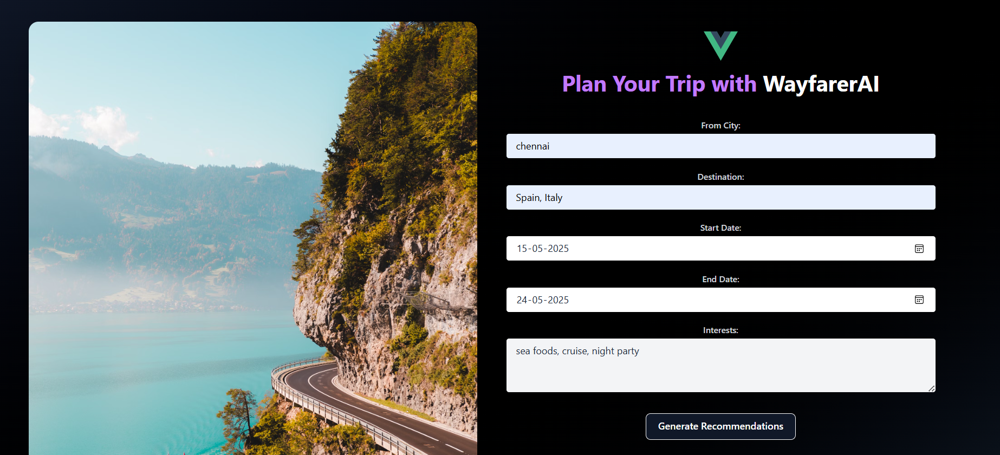

# GEN_AI-travel-assistant

An intelligent travel planning assistant powered by [CrewAI](https://docs.crewai.com/), enabling personalized, multi-agent based itinerary generation. This application consists of a backend and a frontend. The backend utilizes generative AI to suggest destinations, hotels, and activities based on user preferences such as travel type, destination, budget, and month of travel. The frontend provides an interactive user interface to access these recommendations.

---

Check out the website screenshots:





## 🚀 Features

- 🧠 Multi-agent system using CrewAI
- 🔍 Intelligent recommendations for:
  - Travel destinations
  - Budget-friendly hotels
  - Local activities & experiences
- 📡 Uses powerful LLMs for dynamic task execution


## 📂 Project Structure


GEN_AI-travel-assistant/
├── backend/ # Backend code
│   ├── agents.py # Defines AI agents and their roles
│   ├── main.py # Flask API and CrewAI logic
│   ├── tasks.py # Tasks assigned to each agent
│   ├── utils.py # Helper functions
│   └── requirements.txt # Project dependencies
├── frontend/ # Frontend code
│   ├── src/ # Source code
│   │   ├── components/ # Vue components
│   │   ├── services/ # API services
│   │   ├── assets/ # Images and other assets
│   │   └── App.vue # Main Vue component
│   ├── index.html # Main HTML file
│   └── package.json # Frontend dependencies
└── README.md # Project documentation

## 🧠 Agents

Defined in `backend/TravelAgents.py`, the following agents collaborate using the CrewAI framework:

- **City Local Guide Expert**: Provides information on things to do in the city based on user interests.
- **Travel Trip Expert**: Provides travel logistics and essential information.
- **Travel Planning Expert**: Compiles all gathered information to create a travel plan.

Each agent uses a shared or individual LLM instance to complete its task.

---

## 📝 Tasks

Defined in `backend/TravelTasks.py`, each task is mapped to an agent:

- `location_task`
- `guide_task`
- `planner_task`

Tasks are executed in parallel using `crew.kickoff()`.

---

## 🎯 How It Works

1. The user provides travel inputs via the frontend.
2. Agents are initialized with LLM capabilities
3. Each agent executes its task independently
4. Results are combined and displayed in the app

---

## 🛠️ Setup Instructions

### 🔧 Installation

```bash
git clone https://github.com/HarishValliappan/GEN_AI-travel-assistant.git
cd GEN_AI-travel-assistant

### 🔧 Backend Setup
```bash
cd backend
pip install -r requirements.txt
```

### 🚀 Frontend Setup
```bash
cd frontend
npm install
npm run dev
```

